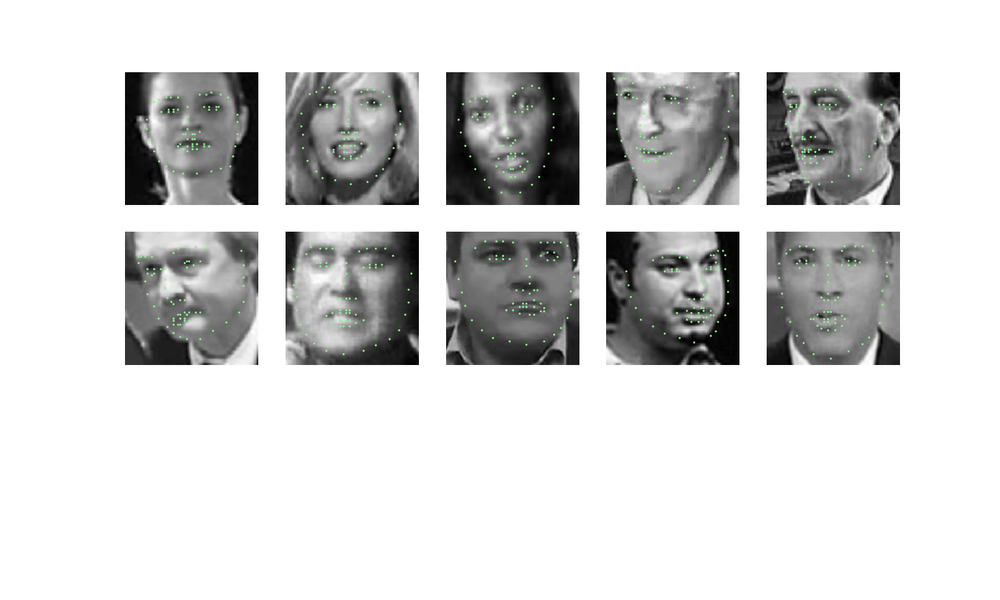
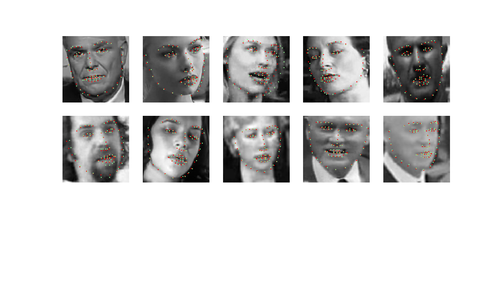
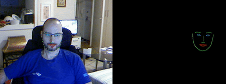

# Facial Keypoints Detection

The project is a part of Udacity Computer Vision Nanodegree. It contains the algorithms for detecting 68 specific facial keypoints. The system comprises from 
* Haar Cascades for face detection, 
* CNN Resnet18 for grayscale images for facial keypoints prediction. 

Pretrained Resnet18 was additionally trained on set of 3462 images

## Training data
Training images are shown in grayscale mode, with green keypoints.

## Results
Test images are shown in grayscale mode, with green keypoints, and red predicted keypoints.

## Camera output
